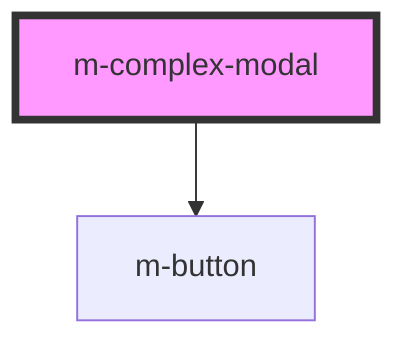

# my-component

<!-- Auto Generated Below -->

## Properties

| Property   | Attribute | Description | Type                                                  | Default                                                 |
| ---------- | --------- | ----------- | ----------------------------------------------------- | ------------------------------------------------------- |
| `contents` | --        |             | `{ title: string; content: string; footer: string; }` | `{     title: '',     content: '',     footer: '',   }` |
| `open`     | `open`    |             | `boolean`                                             | `false`                                                 |

## Events

| Event     | Description | Type               |
| --------- | ----------- | ------------------ |
| `dismiss` |             | `CustomEvent<any>` |

## Dependencies

### Depends on

- [m-button](../m-button)

### Graph

----------------------------------------------

*Built with [StencilJS](https://stenciljs.com/)*
