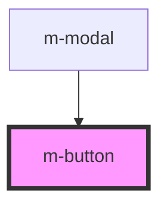

# my-component

<!-- Auto Generated Below -->

## Dependencies

### Used by

 - [m-modal](../m-modal)

### Graph

----------------------------------------------

*Built with [StencilJS](https://stenciljs.com/)*
